## Lab 1 — Map an unknown directory

Commands run:
```bash
mkdir -p ~/lab01/{src,test,docs}/{img,raw}
touch ~/lab01/{src,test,docs}/{img,raw}/empty.file
tree ~/lab01
find ~/lab01 -type d | wc -l
find ~/lab01 -type f
```

### Screenshots

#### Output of tree ~/lab01 showing the full structure
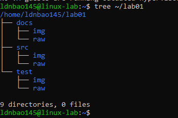

#### Directory count and full file-path listing
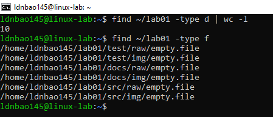

### In report
The brace expansion creates the directory fan-out in one step instead of repeating `mkdir` commands. The `find ... -type d | wc -l` count includes the root directory itself, so the total is one higher than the number of subdirectories. I also used `find ~/lab01 -type f` to print the full file paths and confirm the empty files were created in each leaf folder.

## Lab 2 — Stdout vs stderr — split the streams

Commands run:
```bash
ls /etc /nonexistent > good.txt 2> bad.txt
ls /etc /nonexistent > all.txt 2>&1
ls /etc /nonexistent 2>/dev/null
uptime | tee uptime.txt
cat good.txt
cat bad.txt
cat uptime.txt
```

### Screenshots

#### cat good.txt — show they contain different data
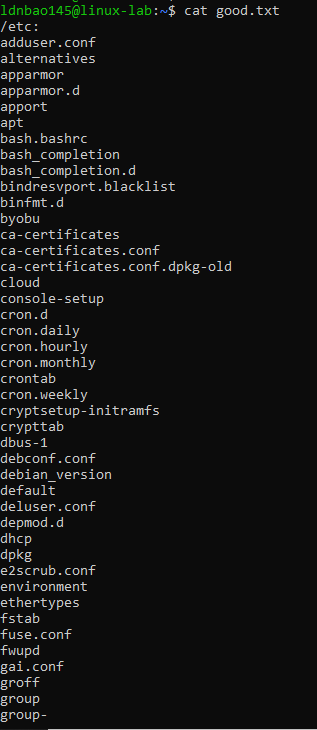

#### cat bad.txt — show they contain different data
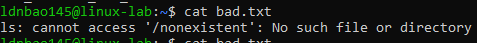

#### The tee command running, output appearing on screen and in the file
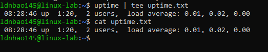

### In report
This lab shows that stdout and stderr are separate streams, so redirecting one does not automatically affect the other. The order of `2>&1` matters: `cmd >f 2>&1` sends both streams to the file, while `cmd 2>&1 >f` sends stderr to the terminal and only stdout to the file. `tee` is useful when I want to save output and still see it live on screen.

## Lab 3 — Find every TODO in a codebase

Repo: https://github.com/redis/redis.git

It has roughly 1838 files.

Commands run:
```bash
grep -rnI -B 1 -E --exclude-dir={node_modules,.git} 'TODO|FIXME|XXX' redis/
grep -nli --exclude-dir={node_modules,.git} 'TODO' redis/ | wc -l
```

### Screenshots

#### At least 10 lines of matches showing filename, line number, and context
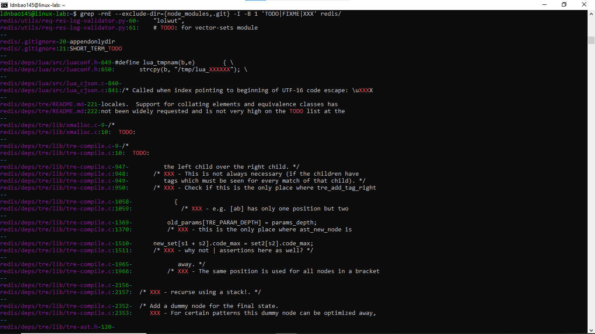

#### The file count from grep -l … | wc -l
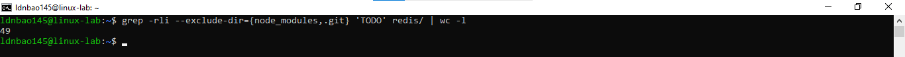

### In report
The search surfaced comments in source files and third-party code, plus a few TODO-style markers in metadata like `.gitignore`. I counted 49 distinct files containing at least one TODO in the repository subset I searched. One thing I would fix first is a stale or ambiguous TODO in the codebase, because those are easy to forget and often hide unfinished work that should really become a tracked issue.

## Lab 4 — Top 10 IPs in access.log

Commands run:
```bash
awk '{print $1}' access.log | sort | uniq -c | sort -rn | head -10
awk '$9==404 {print $7}' access.log | sort | uniq -c | sort -rn | head -5
```

### Screenshots

#### Output of the top-10-IPs pipeline
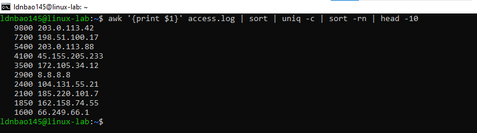

#### Output of the top-5 404 URLs pipeline
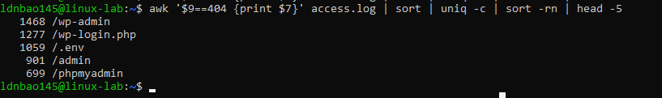

### In report
The top-IP list is heavily skewed, with `203.0.113.42` far ahead of the rest, which looks more like automated traffic than normal browsing. The 404 list is even more telling: paths like `/wp-admin`, `/wp-login.php`, `/.env`, `/admin`, and `/phpmyadmin` are classic probing targets. That usually points to bots or scanners rather than real users.

## Lab 5 — Build a request-rate report by hour

Commands run:
```bash
awk '{ split($4, a, ":"); hours[a[2]]++ } END { for (i in hours) print i, hours[i] }' access.log | sort -n
awk '{ total++; status[$9]++ } END { for (i in status) printf "%s %d %.1f%%\n", i, status[i], (status[i] / total) * 100 }' access.log | sort -n
awk '$9 ~ /^5/ { split($4, a, ":"); count[a[2]]++ } END { for (i in count) print i, count[i] }' access.log | sort -k2 -n
```

### Screenshots

#### The 24-line hour-by-hour count
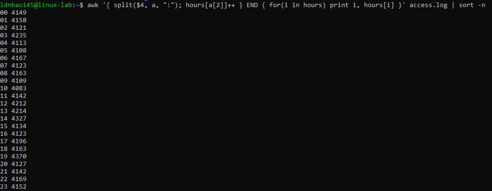

#### Status-code breakdown with percentages
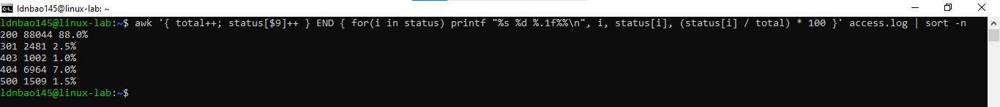

### In report
The peak traffic hour in the screenshot is 19:00 with 4370 requests, while the lowest is 00:00 with 4149 requests. The single hour with the highest 5xx error count is 10, and the lowest 5xx hour is 21. Because the busiest hour is not the same as the worst-error hour, the spike in errors is probably tied to a deployment or service issue rather than simply traffic volume.

## Lab 6 — Bulk-replace strings in config files

Commands run:
```bash
cd ~/lab06/configs
find . -type f -name '*.conf' -print0 | xargs -0 sed -i.bak 's/old-server.local/10.5.0.2/g'
grep -r '10.5.0.2' .
```

### Screenshots

#### Listing of the 5 files and cat of one of them before the replace
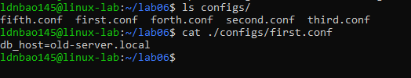

#### The find/xargs/sed command and a grep -r proving all 5 files changed
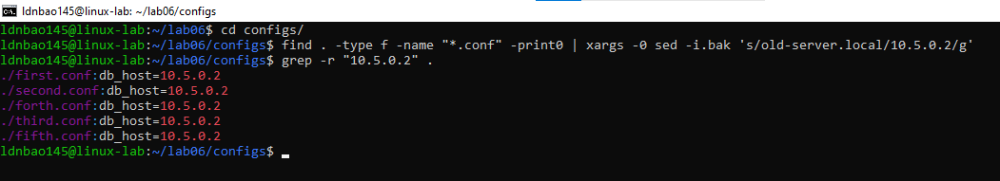

### In report
`xargs` lets me pass all matching files into one `sed` invocation instead of looping in the shell. I used `-print0` and `-0` so filenames stay safe even if they contain spaces or other special characters. The `.bak` suffix keeps a backup copy, which is useful when doing in-place edits across multiple files.

## Lab 7 — Disk-hog hunt & permission audit

Commands run:
```bash
find ~ -type f -printf '%s %p\n' | sort -rn | head -10 | numfmt --field=1 --to=iec
sudo find /tmp -type f -perm -o+w
```

### Screenshots

#### Top-10 largest files in your home
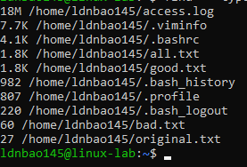

#### World-writable files under /tmp
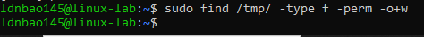

### In report
The largest files were mostly normal user data and shell history files, with `access.log` at the top of the list. The `/tmp` audit returned no world-writable regular files in the screenshot, which is a good sign because it means there was nothing obvious to inspect further. A world-writable file would be dangerous because any local user could tamper with it, inject content, or replace it with something malicious.

## Lab 8 — Hard links, soft links, and the inode

Commands run:
```bash
echo 'Day la noi dung goc' > original.txt
ln original.txt hard.txt
ln -s original.txt soft.txt
ls -li original.txt hard.txt soft.txt
rm -f original.txt
cat hard.txt
cat soft.txt
```

### Screenshots

#### ls -li showing inode numbers for all 3 files before deletion
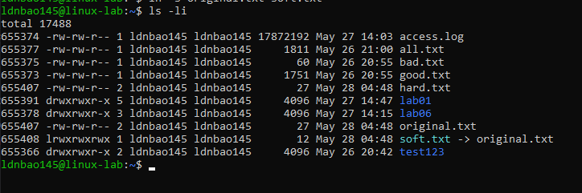

#### cat hard.txt and cat soft.txt after deleting the original
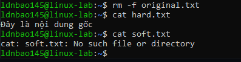

### In report
The inode numbers show that `original.txt` and `hard.txt` point to the same underlying file, while `soft.txt` is only a path reference. After deleting the original name, the hard link still works because the inode still has another directory entry pointing to it. The symlink breaks because it points to a pathname that no longer exists.

## Lab 9 — Make your shell yours

Commands run:
```bash
source ~/.bashrc
mkcd test123
pwd
history | tail -10
```

### My .bashrc Snippets:
```bash
export HISTTIMEFORMAT="%F %T "

alias rm='rm -i'
alias mv='mv -i'
alias cp='cp -i'
alias ..='cd ..'
alias meminfo='free -m -l -t'
alias cpuinfo='lscpu'

# mkcd: make directory and cd into it
mkcd() { mkdir -p "$1" && cd "$1"; }

# extract: universal archive extractor
extract() {
  case "$1" in
    *.tar.gz) tar xzf "$1" ;;
    *.tar.bz2) tar xjf "$1" ;;
    *.zip) unzip "$1" ;;
    *.gz) gunzip "$1" ;;
  esac
}
```

### Screenshots

#### mkcd test123
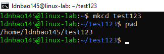

#### history | tail-10
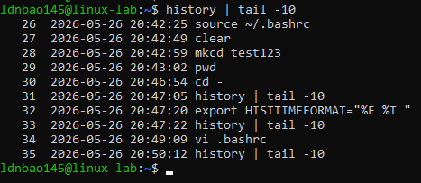

### In report
The aliases reduce repetitive typing and also make destructive commands safer by prompting before overwrite or delete. `mkcd` saved one step every time I needed a new folder, and the screenshot confirms it changed into `test123` immediately. `HISTTIMEFORMAT` makes history much more useful because I can see when each command actually ran, not just what it was.

## Lab 10 — The 3 AM pager — find the bad deploy

Commands run:
```bash
awk '$6 ~ /POST/ && $7 ~ /^\/api\/v1\/payment/ && $9 ~ /^5/ { count[$1]++; if (!first[$1]) first[$1]=$4; last[$1]=$4 } END { for (i in count) print count[i], i, first[i], last[i] }' access.log | sort -nr | head -5
awk '$6 ~ /POST/ && $7 ~ /^\/api\/v1\/payment/ && $9 ~ /^5/ { split($4, a, ":"); hours[a[2]]++ } END { for (i in hours) print i, hours[i] }' access.log | sort -n
```

### Screenshots

#### My one-liner running in the terminal with the top-5 IP table visible
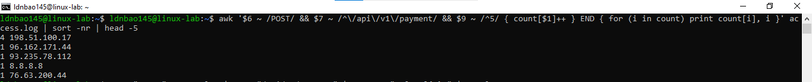

#### The hour-bucket showing when failures clustered
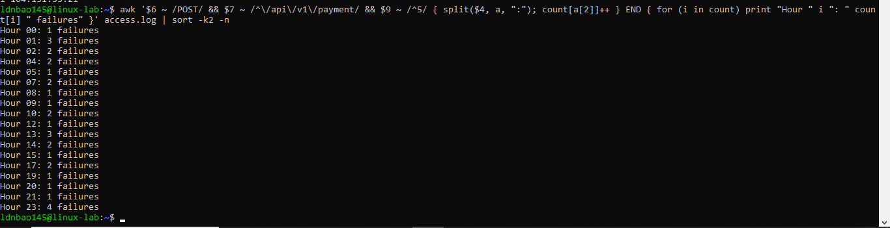

### In report
The top offenders are headed by `198.51.100.17`, which shows four failing requests and a much wider time span than the rest. The hour bucket shows failures scattered across the day, with the strongest small clusters at 01 and 13, each with three failures. That means the incident was not a single isolated spike; it looks more like a recurring issue hitting a small set of clients. If I were on call, I would first check recent deploys or a payment-service dependency, then look for rate-limits, retries, or a broken upstream path before rolling anything back.

### In report
The final table I would report is:

```text
198.51.100.17 4 22/May/2026:04:06:59 22/May/2026:15:43:02
96.162.171.44 1 22/May/2026:07:05:07 22/May/2026:07:05:07
93.235.78.112 1 22/May/2026:23:36:59 22/May/2026:23:36:59
8.8.8.8 1 22/May/2026:10:59:23 22/May/2026:10:59:23
76.63.200.44 1 22/May/2026:17:39:04 22/May/2026:17:39:04
```
