## Lab 01 - Populate a fresh server with users and groups

```bash
# Create groups dev and ops
sudo groupadd dev
sudo groupadd ops

# Create users alice and bob in dev group
sudo useradd -m -s /bin/bash -c "Dev User" -G dev alice
sudo useradd -m -s /bin/bash -c "Dev User" -G dev bob

# Set password for user
sudo passwd alice
sudo passwd bob

# Create users carol and dave in ops group
sudo useradd -m -s /bin/bash -G ops carol
sudo useradd -m -s /bin/bash -G ops dave

# Set password for user
sudo passwd carol
sudo passwd dave

# Check user information
id alice
id carol
```

### Screenshots

#### Output of `id alice` and `id carol` — both users' group memberships visible

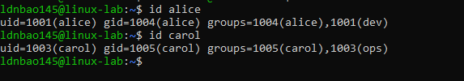

**Identify the UID, primary GID, and supplementary groups in the output:**

- **alice**: 
  - UID: 1001
  - Primary GID: 1004 (alice)
  - Supplementary groups: 1004 (alice), 1001 (dev)

- **carol**:
  - UID: 1003
  - Primary GID: 1005 (carol)
  - Supplementary groups: 1005 (carol), 1003 (ops)

#### `grep -E "alice|bob|carol|dave|svcapp" /etc/passwd` — all 5 rows visible

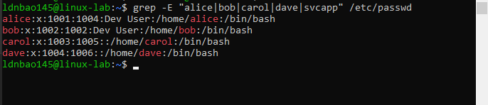

```bash
grep -E "alice|bob|carol|dave|svcapp" /etc/passwd

# Create system user by flag -r and nologin shell by -s /usr/sbin/nologin for user svcapp
sudo useradd -r -s /usr/sbin/nologin svcapp
id svcapp
```

**Identify all 7 colon-separated fields and state what each one means:**

The `/etc/passwd` file format contains 7 colon-separated fields:

1. **Username** (e.g., `alice`): The login name used to authenticate the user
2. **Password** (e.g., `x`): Placeholder for encrypted password; actual password is stored in `/etc/shadow`
3. **UID** (e.g., `1001`): User ID - a unique numeric identifier for the user
4. **GID** (e.g., `1004`): Primary Group ID - the default group for files created by this user
5. **GECOS** (e.g., `Dev User`): User information field; typically contains the user's full name or description
6. **Home Directory** (e.g., `/home/alice`): Absolute path to the user's home directory where they log in
7. **Login Shell** (e.g., `/bin/bash`): Default shell executed when the user logs in

**Create a system user `svcapp` with no home dir and ``nologin` shell: `useradd -r -s /usr/sbin/nologin svcapp`. What UID range does it receive? Why is this different?**

The system user `svcapp` receives a UID of 998, which is below the typical threshold of 1000 for regular users. This is because it is created with the `-r` flag (system user), and Linux reserves UIDs 0-999 for system accounts and services. Regular users usually start from UID 1000 and above. System users are meant for running services and do not require interactive login, hence they are assigned UIDs in the reserved range to differentiate them from human users.

### In report

**Explanation of 7 fields in alice's /etc/passwd entry:**
1. **Username** (alice): Login name of the user
2. **Password** (x): Encrypted password stored in /etc/shadow
3. **UID**: Unique User ID (typically >= 1000 for regular users)
4. **GID**: Primary Group ID of the user
5. **GECOS**: User description field ("Dev User")
6. **Home directory**: User's home directory (/home/alice)
7. **Shell**: Default shell when logging in (/bin/bash)

**System user svcapp receives UID < 1000 (998)** because it's a system user (created with `-r` flag). Linux reserves UID range 0-999 for system accounts and services, while UID >= 1000 is for regular users. System users typically don't need interactive login, hence using `/usr/sbin/nologin` as shell.

## Lab 02 - The silent group-wipe trap

```bash
# Restore all groups
sudo usermod -aG dev,docker,sudo,qa alice
id alice

# Check active groups in shell
su - alice
groups
newgrp dev
```

### Screenshots

#### `id alice` showing 4 groups, then `id alice` after the `-G` trap (1 group left)

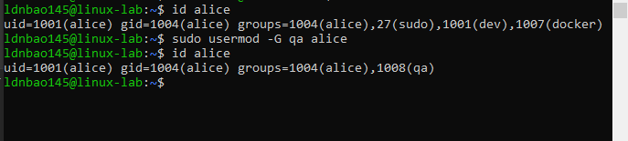

```bash
# Add alice to multiple groups
sudo usermod -aG dev,docker,sudo alice
id alice

# The trap: usermod -G without -a wipes all existing groups
sudo usermod -G qa alice
id alice  # Only qa left!
```

#### The `/etc/shadow` entry for `alice` showing the `!` lock prefix, then after unlocking

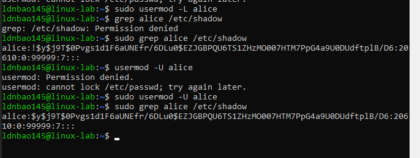

```bash
# Lock and unlock account
sudo usermod -L alice
grep alice /etc/shadow  # ! prefix before password hash
sudo usermod -U alice
grep alice /etc/shadow  # ! prefix removed
```

**The trap: run `usermod -G qa alice` (without `-a`). Run `id alice` again. What happened to dev, docker, and sudo?**

All dev, docker and sudo groups disappeared and were replaced by qa group.

**Run `su - alice` and then `groups` inside her shell. Do her active groups reflect the change yet?**

Inside the new shell, alice's active groups still show the old groups (dev, docker, sudo) because group membership is evaluated at login. The change to qa group will only take effect in a new login session. This is a common source of confusion - the `usermod -G` command modifies the user's group memberships in /etc/group immediately, but existing sessions won't see the change until they log out and back in.

**Inspect `grep alice /etc/shadow` — what character appears before her password hash?**

The character appears before her password hash is `!`

### In report

**Explanation of the differences:**
- **`-g`** (lowercase): Changes the primary group (main GID) of the user
- **`-G`**: Sets the list of supplementary groups - **OVERWRITES** all existing supplementary groups
- **`-aG`**: **APPENDS** user to supplementary groups without removing existing ones

**Real-world dangerous scenario:** If alice has sudo access and an admin accidentally runs `usermod -G newgroup alice` to add a new group, alice will **immediately lose sudo access** with no warning. This can cause severe production outage if alice is performing a deployment or handling an urgent incident and suddenly loses sudo privileges.

## Lab 03 - Read, write, execute — controlling file access

### Screenshots

#### `ls -la` showing `secret.txt` at `600` and `reports/` at `750` with `alice:dev` ownership

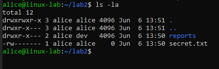

```bash
# Create file and directory
touch secret.txt
mkdir reports

# Use octal chmod
chmod 600 secret.txt # rw------- (6=rw, 0=---, 0=---)
chmod 750 reports/  # rwxr-x--- (7=rwx, 5=r-x, 0=---)

# Use symbolic chmod
chmod u+x,g=rx,o-rwx reports/

# Change ownership
chown -R alice:dev reports/
ls -la
```

#### `umask` set to `027` and the resulting permissions on a newly created file and directory

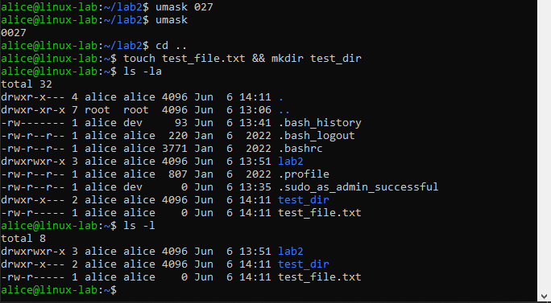

```bash
# Change umask and test
umask 027
touch test_file.txt
mkdir test_dir
ls -l  # File: 640 (666-027=640), Dir: 750 (777-027=750)
```

**Use octal chmod: set `secret.txt` → `600`, `reports/` → `750`. For each, write out what the three octal digits mean in rwx terms?**

Each octal digit (0-7) represents 3 bits in binary (r,w,x):

```
Octal to Binary mapping:
0 = 000 (---)
1 = 001 (--x)
2 = 010 (-w-)
3 = 011 (-wx)
4 = 100 (r--)
5 = 101 (r-x)
6 = 110 (rw-)
7 = 111 (rwx)
```

**`secret.txt` → `600`:**
```
  6    0    0
110  000  000
rw-  ---  ---
Owner: read+write
Group: no permissions
Others: no permissions
Result: rw------- (only owner can read/write)
```

**`reports/` → `750`:**
```
  7    5    0
111  101  000
rwx  r-x  ---
Owner: read+write+execute (enter directory)
Group: read+execute (list and enter, no write/delete)
Others: no permissions
Result: rwxr-x--- (owner full control, group can list/enter)
```

**Change the umask to `027` and create a new file and directory. What permissions did they receive? Explain using the formula base − umask.**

When umask is set to `027`, the umask acts as a **bit-wise mask** that masks (removes) permission bits. Each octal digit represents 3 bits (rwx):

**Umask Breakdown: 027**
```
0      2      7
|      |      |
owner  group  others

0 = 000 (no mask for owner)
2 = 010 (mask write for group)
7 = 111 (mask all for others)
```

**For NEW FILE (default base 666):**

```
Base permissions:    666 = 110 110 110 (rw- rw- rw-)
Umask (NOT applied): 750 = 111 101 000
                           (remove: own, grp-write, all-others)
Result:              640 = 110 100 000 (rw- r-- ---)
```

**For NEW DIRECTORY (default base 777):**

```
Base permissions:    777 = 111 111 111 (rwx rwx rwx)
Umask (NOT applied): 750 = 111 101 000
                           (remove: own, grp-write, all-others)
Result:              750 = 111 101 000 (rwx r-x ---)
```

**How bit-wise AND with complement works:**
- Umask `027` = `000 010 111` (binary)
- NOT(027) = `111 101 000` (binary) — this is the "permission allowed" mask
- Final = Base AND NOT(Umask):
  - File: `110 110 110 AND 111 101 000 = 110 100 000` = `640`
  - Dir: `111 111 111 AND 111 101 000 = 111 101 000` = `750`

**Key insight**: The umask specifies which bits to REMOVE from default permissions. Bits set to 1 in the umask are REMOVED, bits set to 0 are KEPT.

**Experiment: create a file owned by alice with permissions `640`, group `dev`. Log in as bob (also in dev) and try to read it. Then log in as dave (in ops) and try to read it. Explain why each succeeded or failed?**

```bash
# Experiment with permission evaluation
touch testfile.txt
chown alice:dev testfile.txt
chmod 640 testfile.txt
su - bob      # bob is in dev group - can read
cat testfile.txt
exit
su - dave     # dave is in ops group - cannot read
cat testfile.txt  # Permission denied
```

**Explain why each succeeded or failed?**

File permissions in binary: `640` = `110 100 000`
```
6        4        0
|        |        |
Owner    Group    Others
rw-      r--      ---
110      100      000
```

**File info**: owned by alice:dev, permissions 640 (rw-r-----)

(a) **Bob reading the file: SUCCEEDED**

Bob is in the dev group. Linux checks permissions in order:
1. Is Bob the root user (UID=0)? NO
2. Is Bob's UID == alice's UID? NO → **Skip owner bits (110)**
3. Is Bob's GID == file's GID (dev)? YES → **Use group bits (100)**
4. Group permission check: `100` = read(1) write(0) execute(0)
   - Read bit is 1 ✓ **READ ALLOWED**

Result: Bob can read because group permissions include read.

(b) **Dave reading the file: FAILED**

Dave is in the ops group (NOT dev). Linux checks permissions in order:
1. Is Dave the root user (UID=0)? NO
2. Is Dave's UID == alice's UID? NO → **Skip owner bits (110)**
3. Is Dave's GID == file's GID (dev)? NO → **Skip group bits (100)**
4. Dave doesn't match owner or group → **Use other bits (000)**
5. Other permission check: `000` = read(0) write(0) execute(0)
   - Read bit is 0 ✗ **READ DENIED**

Result: Dave cannot read because he's not in the dev group and others have no permissions.

### In report

**Permission evaluation order (Linux permission model):**

Linux checks file access in this exact order, using **bit-wise AND** to evaluate:

```
File 640:  rw-  r--  ---
           110  100  000
```

For **any user access** (e.g., reading):

```
Step 1: Is user UID == 0 (root)?
        If YES → Grant access immediately (bypass all checks)

Step 2: Is user UID == file owner?
        If YES → Check owner bits (rw-)
                 Can user read? = bit[2] = 1 ✓

Step 3: Is user GID == file group?
        If YES → Check group bits (r--)
                 Can user read? = bit[2] = 1 ✓

Step 4: Check other bits (---)
        Can user read? = bit[2] = 0 ✗
```

**IMPORTANT**: Linux evaluates in order and STOPS at the first match. It never evaluates remaining categories.

- **Bob** (GID=dev): Matches Step 3 → uses group bits (100) → read bit is 1 ✓ **ALLOWED**
- **Dave** (GID=ops): Doesn't match owner/group → evaluates Step 4 → uses other bits (000) → read bit is 0 ✗ **DENIED**

## Lab 04 - Special permission bits: shared directories and elevated execution

### Screenshots

#### `ls -ld /opt/teamshared` showing the `s` (SGID) and `t` (sticky) characters in the permission string

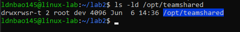

```bash
# Create shared directory with SGID and sticky bit
sudo mkdir /opt/teamshared
sudo chown root:dev /opt/teamshared
sudo chmod 3775 /opt/teamshared  # 3=SGID(2)+sticky(1), 775=rwxrwxr-x
ls -ld /opt/teamshared  # drwxrwsr-t
```

**Understanding special permission bits in chmod 3775:**

```
3    7    7    5
|    |    |    |
|    +----+----+--- Basic permissions (775)
+--- Special bits (3)

Breaking down:
3 = 0011 (binary)
    0001 = Sticky bit (t)
    0010 = SGID bit (s)

7 = 111 (rwx)
7 = 111 (rwx)
5 = 101 (r-x)

Final: drwxrwsr-t
       |||||||||+--- Sticky bit (t) - only owner/root can delete files
       ||||||||+---- Group execute becomes group setid (s)
       +++++++++---- Regular permissions 775
```

**What each bit does:**
- **SGID (2 = 010)**: New files inherit group ownership from directory
- **Sticky (1 = 001)**: Only file owner or directory owner can delete files
- **Regular rwx**: Standard read/write/execute permissions for owner/group/others

#### Bob's failed `rm` attempt on `alice`'s file (Operation not permitted)

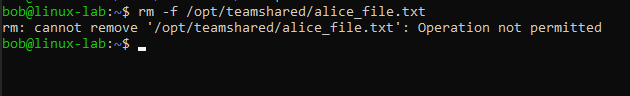

#### Output of the `SUID` binary search — at least 3 results visible


```bash
# Find SUID binaries
find / -perm -4000 -type f 2>/dev/null
```

**Find all SUID binaries on the system: `find / -perm -4000 2>/dev/null`. Identify at least 3 you recognize and explain in your report why each one needs SUID?**

Common SUID binaries and their purposes:

1. **`/usr/bin/passwd`** - Allows users to change their own password
   - Needs SUID because passwords are stored in `/etc/shadow`, which only root can write to
   - Without SUID, regular users couldn't update their own password hashes
   - The passwd binary runs as root temporarily, validates the user, and updates the shadow file safely

2. **`/usr/bin/sudo`** - Allows authorized users to run commands as root
   - Needs SUID because it must gain root privileges to execute privileged commands
   - Sudo checks sudoers policies, logs who ran what command, and temporarily elevates privileges
   - Without SUID, sudo couldn't authenticate properly or escalate privileges

3. **`/usr/bin/mount`** - Allows mounting filesystems
   - Needs SUID because mounting requires kernel-level filesystem changes only root can perform
   - Users shouldn't be able to mount untrusted filesystems (security risk), but SUID with strict validation allows limited mounting
   - Without SUID, only root could mount any filesystem

**As alice (`su - alice`), create a file inside `/opt/teamshared`. Log back out as root and check `ls -l /opt/teamshared`. What group owns alice's file and why?**

alice's file is owned by the **dev group** (not alice's primary group).

**Why?** Because `/opt/teamshared` has the **SGID (Set-Group-ID) bit** set (chmod `3775` = SGID=2, sticky=1, 775=rwxrwxr-x). When SGID is set on a directory:
- Any file created inside that directory automatically inherits the directory's group ownership (dev)
- This ensures all project files maintain consistent group ownership regardless of which user creates them
- In this case, even though alice created the file with her primary group, SGID forced it to inherit the dev group
- This is perfect for shared team directories where you want all files to have the same group so team members can collaborate

```bash
# Test SGID - new files inherit group
su - alice
touch /opt/teamshared/alice_file.txt
exit
ls -l /opt/teamshared  # alice_file.txt belongs to dev group
```

**Test the sticky bit: as bob, try to delete alice's file. Confirm it fails. Now remove the sticky bit from the directory (`chmod -t`) and try again. What changes?**

```bash
# Test sticky bit
su - bob
rm /opt/teamshared/alice_file.txt  # Operation not permitted
exit

# Remove sticky bit and try again
sudo chmod -t /opt/teamshared
su - bob
rm /opt/teamshared/alice_file.txt  # Success!
exit
```

**What changes?**

With sticky bit (`t`) enabled:
- Bob **cannot delete** alice's file even though he has write permission on the directory
- Error: "Operation not permitted"
- **Why**: The sticky bit restricts deletion to the file owner or directory owner only. Bob is neither (alice owns the file, root owns the directory), so deletion is blocked

Without sticky bit:
- Bob **can delete** alice's file successfully
- **Why**: Without sticky bit, write permission on the directory is sufficient to delete any file in it. Bob has write permission, so he can delete even files he doesn't own

**Key insight**: Sticky bit prevents the "rm" trap in shared directories where any user with write permission could maliciously delete other users' files. This is essential for /tmp and shared team directories.

**Restore the sticky bit. Create a small script `/tmp/whotest.sh` containing `echo "Running as: $(whoami)"`. Set SUID on it (`chmod u+s`) and make it owned by root. Run it as alice. What identity does it report?**

```bash
# Restore sticky bit
sudo chmod +t /opt/teamshared

# Test SUID
echo 'echo "Running as: $(whoami)"' > /tmp/whotest.sh
chmod +x /tmp/whotest.sh
sudo chown root:root /tmp/whotest.sh
sudo chmod u+s /tmp/whotest.sh
su - alice

alice@linux-lab:~$ bash /tmp/whotest.sh
Running as: alice
```

### In report

**Why SUID on /bin/bash is a critical security vulnerability:**

If /bin/bash has the SUID bit set and is owned by root, any user can run bash with root privileges. Exploitation steps:

1. Regular user runs: `/bin/bash -p` (the -p flag preserves the effective UID)
2. Shell starts with effective UID = 0 (root)
3. Attacker now has a complete root shell
4. Can read/write any file, create new users, change passwords, install malware

This is why only specific programs like passwd, sudo, and ping are designed to safely use SUID.

## Lab 05 - Fine-grained access control with ACLs

### Screenshots

#### Full `getfacl /opt/project` output showing user, group, mask, and default ACL entries

**Before setting ACL**

```bash
root@linux-lab:~# getfacl /opt/project
getfacl: Removing leading '/' from absolute path names
# file: opt/project
# owner: root
# group: dev
user::rwx
group::rwx
other::---

root@linux-lab:~#
```

**After setting ACL**

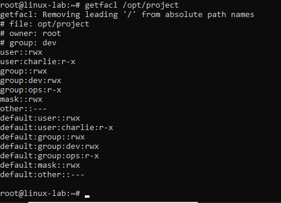

```bash
# Install ACL tools if needed
sudo apt install acl

# Create user charlie and project directory
sudo useradd -m -s /bin/bash charlie
sudo mkdir /opt/project
sudo chown root:dev /opt/project
sudo chmod 770 /opt/project

# Apply ACLs
sudo setfacl -m g:dev:rwx /opt/project
sudo setfacl -m g:ops:r-x /opt/project
sudo setfacl -m u:charlie:r-x /opt/project
getfacl /opt/project
ls -la /opt  # Note the + character after permissions

# Set default ACL for inheritance
sudo setfacl -d -m g:dev:rwx,g:ops:r-x,u:charlie:r-x /opt/project

su - alice
touch /opt/project/testfile
exit
getfacl /opt/project/testfile  # Inherited ACLs visible
```

#### `getfacl` before and after `chmod g-x` — show the `#effective` comment change in the mask trap

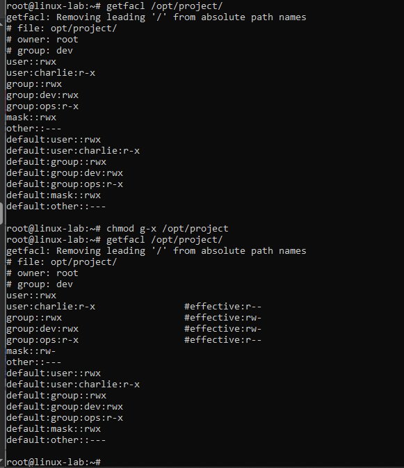

```bash
# The mask trap
sudo chmod g-x /opt/project
getfacl /opt/project  # Check #effective comments on permissions
```

**The mask trap: run `chmod g-x /opt/project`. Run `getfacl /opt/project` again. What happened to the effective permissions for `dev` and `charlie`? Why?**

**Before `chmod g-x`:**
```
ACL entry for dev:    rwx = 111
Mask:                 r-x = 101
Effective:     111 AND 101 = 101 (rwx = execute works)
```

**After `chmod g-x` (removes group execute from mask):**
```
ACL entry for dev:    rwx = 111  (unchanged!)
Mask:                 r-- = 100  (modified by chmod)
Effective:     111 AND 100 = 100 (rw- = execute lost!)

ACL entry for charlie: r-x = 101  (unchanged!)
Mask:                  r-- = 100  (modified by chmod)
Effective:      101 AND 100 = 100 (r-- = execute lost!)
```

**The trap explained:**
- The ACL entries (`g:dev:rwx` and `u:charlie:r-x`) are still there in the ACL table
- But `chmod g-x` changed the mask from `101` to `100`
- getfacl shows `#effective:rw-` and `#effective:r--` instead of the full ACL entries
- The permissions are silently reduced because effective = entry AND mask

**Why it's dangerous:**
1. Admins don't realize `chmod` modifies the mask, not ACL entries
2. They see `getfacl` output but don't understand the `#effective` comments
3. When restored with `chmod g+x`, permissions magically work again
4. This confusion causes hours of debugging

```bash
# Restore mask
sudo chmod g+x /opt/project

# Revoke charlie's ACL
sudo setfacl -x u:charlie /opt/project
getfacl /opt/project
```

### In report

**What is the ACL mask and why `chmod` can silently cut effective permissions:**

The ACL **mask** defines the maximum effective permissions (ceiling) for all named users, named groups, and the owning group.

**How mask acts as a ceiling:**

```
Scenario: charlie has ACL rwx but mask is r--

ACL entry:  rwx = 111
Mask:       r-- = 100
Effective:  111 AND 100 = 100 (r-- only)

Even though ACL grants rwx (111), the mask limits to r-- (100).
The mask is the "AND gate" that filters the ACL entry.
```

**How `chmod` modifies the mask (not ACL entries):**

```
$ chmod g-x /opt/project

This command MODIFIES the mask, not the ACL entries!

Before:  mask = r-x = 101
After:   mask = r-- = 100

The ACL entry still says u:charlie:rwx, but effective becomes r--.
```

**When to use ACLs instead of standard chmod:**
- When you need to grant specific permissions to **more than one group** on the same resource
- When you need to give **individual users** special access without creating a dedicated group
- When you need **inheritance** (default ACLs) for new files in a directory
- When standard owner/group/other model is too restrictive for complex permission requirements

## Lab 06 - Grant surgical sudo access to a CI deploy user

### Attach

#### Contents of `/etc/sudoers.d/deploy`

```bash
deploy ALL=(root) NOPASSWD: /opt/scripts/deploy.sh, /bin/systemctl restart cron
```

```bash
# Create deploy system user
sudo useradd -r -s /usr/sbin/nologin deploy
su - deploy  # Should fail - no login shell

# Create deploy script
sudo mkdir -p /opt/scripts
echo 'echo "Deploying application..."' | sudo tee /opt/scripts/deploy.sh
sudo chmod 750 /opt/scripts/deploy.sh
sudo chown root:dev /opt/scripts/deploy.sh
```

### Screenshots

#### The allowed command succeeding and the denied command being rejected — both in the same terminal session

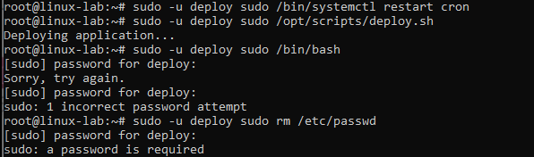

```bash
# Create sudoers rule for deploy user
sudo visudo -f /etc/sudoers.d/deploy
# Add this line:
# deploy ALL=(root) NOPASSWD: /opt/scripts/deploy.sh, /bin/systemctl restart cron

# Test allowed commands
sudo -u deploy sudo /opt/scripts/deploy.sh  # Should succeed
sudo -u deploy sudo /bin/systemctl restart cron  # Should succeed

# Test denied commands
sudo -u deploy sudo /bin/bash  # Should be rejected
sudo -u deploy sudo rm /etc/passwd  # Should be rejected
```

#### The `auth.log` entries showing an allowed `COMMAND` and a `DENIED` attempt with timestamps


```bash
# Check audit trail
grep "deploy" /var/log/auth.log | tail -20
```

### In report

**Why use separate files in /etc/sudoers.d/ instead of editing main sudoers:**

1. **Modularity**: Each service/role gets its own file, making it easy to track and remove specific permissions
2. **Package management**: Applications can install their own sudoers rules without modifying the main file. Easier to audit, easier to remove — and you never touch the base sudoers file.
3. **Easier auditing**: You can review permissions per service/user without parsing a monolithic file
4. **Safer updates**: OS updates won't overwrite custom rules if they're in separate files
5. **Team collaboration**: Multiple admins can manage different services without merge conflicts

**Risk of granting NOPASSWD: ALL to a service account:**

This gives the service account **unrestricted root access** without any authentication. Risks include:
- If the service is compromised, attacker has instant root access
- No password prompt means automated scripts can escalate silently
- Violates principle of least privilege - service may only need 1-2 specific commands
- No opportunity to detect/block suspicious sudo usage
- Service bugs could accidentally run destructive commands as root

## Lab 07 - Incident response — compromised account containment

### Screenshots

#### `/etc/shadow` entry for `bob` showing the `!` lock prefix


```bash
# IMMEDIATE CONTAINMENT - Lock the account
sudo usermod -L bob
grep bob /etc/shadow  # Verify ! prefix before password hash
```

#### `id bob` before containment (`sudo` + `docker`) and after (only `docker`)


```bash
# Revoke elevated access
sudo gpasswd -d bob sudo
sudo gpasswd -d bob docker

# Kill active sessions
sudo pkill -u bob
who  # Verify bob is not logged in
ps aux | grep "^bob"  # Verify no bob processes running

# Audit what bob did
last bob  # View login history
grep "bob" /var/log/auth.log  # Check sudo usage

# Find recently modified files owned by bob
touch -d "1 hour ago" /tmp/marker
find /home/bob -newer /tmp/marker 2>/dev/null
find / -user bob -newer /tmp/marker 2>/dev/null

# RECOVERY - Unlock and force password reset
sudo usermod -U bob
sudo passwd -e bob  # Expire password, forces reset on next login
sudo usermod -aG docker bob  # Restore only docker group (not sudo)

id bob  # Verify only docker group remains (or should be removed too)
```

#### Output of `last bob` showing login history


### In report

**Incident Timeline:**

1. **00:00 - Alert received**: Bob's credentials found in data breach, currently has sudo and docker group membership
2. **00:01 - Account locked**: Executed `usermod -L bob` to prevent further authentication
3. **00:02 - Sessions terminated**: Used `pkill -u bob` to kill all active processes and sessions
4. **00:03 - Privilege revocation**: Removed bob from sudo and docker groups using `gpasswd -d`
5. **00:05 - Forensic audit**: Checked `last bob` for login history and searched auth.log for sudo commands executed
6. **00:10 - File audit**: Used `find` to locate recently modified files owned by bob for evidence collection
7. **00:20 - Investigation complete**: No malicious activity detected in logs or file modifications
8. **00:25 - Account recovery**: Unlocked account with `usermod -U`, forced password reset with `passwd -e`, restored only docker group access following least privilege principle

**Worst-case impact if bob had NOPASSWD: ALL:**

If bob had `NOPASSWD: ALL` in sudoers, an attacker with his credentials could:
- Install persistent backdoors (rootkits, modified SSH configs, cron jobs)
- Create new privileged accounts for future access
- Exfiltrate sensitive data from the entire system
- Modify audit logs to cover tracks
- Install cryptocurrency miners or botnet agents
- Pivot to other systems using stored credentials/keys
- All without triggering password prompts that might alert monitoring systems

## Lab 08 - Survive SSH disconnections with tmux

### Screenshots

#### `tmux ls` showing the session alive after detaching, with the step counter number visible


```bash
# Install tmux if needed
sudo apt install tmux

# Create named session with long-running job
tmux new -s dataproc
for i in $(seq 1 300); do echo "Step $i of 300"; sleep 1; done

# Detach from session (Ctrl+B then D)
# Back in regular terminal:
tmux ls  # List sessions, verify dataproc is still running
```

#### The 2-pane view: the counter loop running in one pane and `top` in the other


```bash
# Close terminal completely, then reopen and reattach
tmux attach -t dataproc  # Counter should still be incrementing

# Inside tmux session - split pane vertically
# Ctrl+B %
top  # Run in right pane

# Navigate between panes
# Ctrl+B ←→ arrows

# Zoom into one pane and back
# Ctrl+B Z (toggle)
```

#### The window list `(Ctrl+B W)` showing both windows, with the renamed `monitor` window visible


```bash
# Create second window
# Ctrl+B C

# Rename window to "monitor"
# Ctrl+B ,
# Type: monitor

# Switch between windows
# Ctrl+B 0  (first window)
# Ctrl+B 1  (second window)

# List all windows
# Ctrl+B W
```

```bash
# Rename entire session
tmux rename-session lab08
tmux ls  # Verify new name
```

### In report

**Real scenario where tmux would prevent losing work:**

During a database migration on a production server, I was running a 2-hour data export over SSH from my home network. About 30 minutes in, my WiFi briefly disconnected. Without tmux, the SSH connection would drop and the export process would terminate, forcing me to restart from scratch. With tmux, the session continues running on the server regardless of my local connection - I simply reconnect and reattach to see the export still progressing.

**What "detach" means at OS level:**

When you detach from a tmux session, the tmux server process (running on the remote machine) keeps running along with all shells and programs inside it. Your local terminal's SSH connection is only a "viewer" that connects to the tmux server - disconnecting the viewer doesn't affect the server. The processes remain attached to the tmux server's pseudo-terminals (PTYs), not your SSH session's terminal. When you reattach, tmux simply reconnects your terminal to those same PTYs, giving you back control of processes that never stopped running.

## Lab 09 - Diagnose and tame a runaway process

```bash
root@linux-lab:~# ps -p 2820 -o pid,comm,user,pcpu,pmem,nice,etime
    PID COMMAND         USER     %CPU %MEM  NI     ELAPSED
   2820 python3         root     99.4  0.2   0       01:50
```

### Screenshots

#### `top` showing the python3 process near 100% CPU before renicing (NI = 0)


```bash
# Start CPU hog in background
python3 -c "while True: pass" &
# Note the PID printed

# Check in top (press P to sort by CPU)
top
```

#### `top` after `renice -n 19` showing the NI column changed to 19


```bash
# Deprioritize the process (keep it running)
sudo renice -n 19 -p <PID>
# Watch NI column change in top
top
```

**Deprioritize (keep it running): lower its priority with renice -n 19 -p <PID>. Watch the NI column in top change. Does other terminal activity feel more responsive now?**

**Yes, terminal activity becomes noticeably more responsive.**

When the process is reniced to 19 (the lowest priority):
- The NI column changes from 0 (normal priority) to 19 (lowest priority)
- The %CPU usage drops significantly (from ~99% to much lower)
- The process still runs and continues incrementing the counter, but at a much slower pace
- Other terminal commands (typing, SSH commands, etc.) feel snappy and responsive because the CPU scheduler now prioritizes them over the low-priority python3 process
- The system remains usable even though a CPU-intensive job is running

This is the power of nice/renice - instead of killing a misbehaving process, you can de-prioritize it, letting it continue background work while keeping the system responsive for interactive use.

#### The `jobs` listing and the bg/fg/kill cycle for the `sleep 999` job


```bash
# Job control practice
sleep 999 &
jobs  # List background jobs
fg %1  # Bring to foreground
# Press Ctrl+Z to suspend
bg %1  # Send to background
kill %1  # Kill by job number
jobs  # Verify it's gone
```

```bash


# Inspect the process details
ps -p <PID> -o pid,comm,user,pcpu,pmem,nice,etime
# Record NI (nice) value and elapsed time


# Signal escalation - try graceful termination first
kill <PID>  # Sends SIGTERM (15)
sleep 3
ps -p <PID>  # Check if still running

# Force kill if needed
kill -9 <PID>  # Sends SIGKILL (9)
ps -p <PID>  # Should be gone


# Stretch: launch with nice value
nice -n 10 python3 -c "while True: pass" &
top  # Compare NI column to default process

# Try setting negative nice as regular user (should fail)
renice -n -5 -p <PID>
# Only root can set negative nice values
```

### In report


**Explanation of signals:**

- **SIGTERM (15)**: Polite termination request. Allows the process to catch the signal, clean up resources (close files, flush buffers, save state), and exit gracefully. Use this first for any important process like databases or web servers.

- **SIGKILL (9)**: Immediate forced termination. Cannot be caught or ignored. The kernel instantly destroys the process with no cleanup. Use only as last resort when SIGTERM fails, as it can leave files corrupted, locks unreleased, or databases in inconsistent state.

- **SIGSTOP (19)**: Pause/freeze the process. Cannot be caught. Process stops executing but remains in memory. Use when you need to temporarily halt a process without terminating it (e.g., to free CPU for urgent task).

- **SIGHUP (1)**: "Hangup" - originally sent when terminal disconnects. Many daemons interpret this as "reload configuration". Use to tell services like nginx or sshd to reread their config files without full restart.

- **SIGCONT (18)**: Resume a stopped process. Counterpart to SIGSTOP. Process continues execution from where it was frozen.

**Why `kill -9` is always the last resort:**

SIGKILL gives the process zero opportunity to clean up. This can cause:
- Database corruption (transaction not committed/rolled back)
- Orphaned lock files preventing restart
- Unsaved data loss
- Socket/port remaining in TIME_WAIT state
- Child processes becoming orphans
- Temporary files not deleted

Always try SIGTERM first, wait a few seconds, then escalate to SIGKILL only if the process refuses to die.

## Lab 10 - Harden a multi-role development server from scratch

### Screenshots

#### `getfacl /opt/appdata` and `getfacl /var/log/applog/` showing complete ACL setup


```bash
# 1. Create users and groups
sudo groupadd devs
sudo groupadd ops
sudo groupadd auditors

sudo useradd -m -s /bin/bash -G devs alice
sudo useradd -m -s /bin/bash -G ops carol
sudo useradd -m -s /bin/bash -G auditors eve
sudo useradd -r -s /usr/sbin/nologin -G devs cirunner

sudo passwd alice
sudo passwd carol
sudo passwd eve

# 2. Project directory setup
sudo mkdir /opt/appdata
sudo chown root:devs /opt/appdata
sudo chmod 2770 /opt/appdata  # SGID + full group access

# Apply ACLs
sudo setfacl -m g:ops:r-x /opt/appdata
sudo setfacl -m g:auditors:r-- /opt/appdata

# Set default ACL for inheritance
sudo setfacl -d -m g:devs:rwx,g:ops:r-x,g:auditors:r-- /opt/appdata

getfacl /opt/appdata

# 3. Log directory setup
sudo mkdir -p /var/log/applog
sudo chown root:ops /var/log/applog
sudo chmod 750 /var/log/applog

# Grant devs write access and auditors read-only
sudo setfacl -m g:devs:rwx /var/log/applog
sudo setfacl -m g:auditors:r-x /var/log/applog

# Set default ACL
sudo setfacl -d -m g:ops:r-x,g:devs:rwx,g:auditors:r-x /var/log/applog

getfacl /var/log/applog
```

#### Access verification: `alice` writing successfully, `carol` denied, `eve` denied — all in one terminal session


#### `sudo` tests — each role's allowed command succeeding and a disallowed command being rejected


```bash

# 4. Sudo policy
sudo mkdir -p /opt/scripts
echo 'echo "Deploy complete"' | sudo tee /opt/scripts/deploy.sh
sudo chmod 750 /opt/scripts/deploy.sh
sudo chown root:devs /opt/scripts/deploy.sh

# Create sudoers files
sudo visudo -f /etc/sudoers.d/devs
# Add: %devs ALL=(root) /opt/scripts/deploy.sh

sudo visudo -f /etc/sudoers.d/ops
# Add: %ops ALL=(root) /bin/systemctl status cron

sudo visudo -f /etc/sudoers.d/cirunner
# Add: cirunner ALL=(root) NOPASSWD: /opt/scripts/deploy.sh

# 5. Verify access
su - alice
touch /opt/appdata/alice_test.txt  # Should succeed
exit

su - carol
touch /opt/appdata/carol_test.txt  # Should fail - Permission denied
cat /opt/appdata/alice_test.txt  # Should succeed - can read
exit

su - eve
touch /opt/appdata/eve_test.txt  # Should fail
touch /tmp/eve_test.txt  # Should fail in most protected directories
cat /opt/appdata/alice_test.txt  # Should succeed - read-only
exit

# Test cirunner can write logs
sudo -u cirunner touch /var/log/applog/deploy.log  # Should succeed
```

#### Security audit results: `UID=0` check, `world-writable` check, `SUID` check — all clean


```bash
# 6. Security audit
# Check UID=0 accounts
awk -F: '$3==0 {print $1}' /etc/passwd  # Should only show root

# Find world-writable files in /opt
find /opt -type f -perm -002 2>/dev/null  # Should be empty

# Find SUID binaries you created
find /opt /home -perm -4000 -type f 2>/dev/null  # Should be none
```

### In report

**Design Summary:**

This multi-role server implements defense-in-depth security using SGID, ACLs, and surgical sudo policies. The devs group has full read/write access to application data and can deploy code. The ops group monitors logs and services with read-only access to app data. Auditors have universal read access but zero write capability anywhere. The cirunner automated account can deploy without interactive login using NOPASSWD for the specific deploy script only.

SGID on /opt/appdata ensures all new files inherit the devs group, maintaining consistent ownership. Default ACLs propagate permissions to new files automatically. Each role's sudo access is limited to their specific job function - devs deploy apps, ops check service status, cirunner automates deployments. No role has unrestricted sudo access.

The security audit confirms no rogue UID=0 accounts exist, no world-writable files in /opt that could be exploited, and no unnecessary SUID binaries that could lead to privilege escalation.

**Permission Summary Table:**

| User | Groups | /opt/appdata | /var/log/applog | sudo rights |
|---------|----------|--------------|-----------------|-------------|
| alice | devs | rwx | rwx | /opt/scripts/deploy.sh |
| carol | ops | r-x | r-x | /bin/systemctl status cron |
| eve | auditors | r-- | r-- | None |
| cirunner| devs | rwx | rwx | NOPASSWD: /opt/scripts/deploy.sh |

**Why cirunner must be a system user with nologin:**

CI/CD automation accounts should never allow interactive login because:
1. They run automated scripts, not human sessions - a login shell is unnecessary and increases attack surface
2. If compromised, an attacker cannot get an interactive shell to explore the system
3. System users (UID < 1000) are clearly marked as service accounts, not human users
4. The nologin shell prevents su/sudo into an interactive session while still allowing command execution
5. Prevents accidental human use of a service account that may have elevated privileges
6. Aligns with principle of least privilege - grant only what's needed (command execution), nothing more
